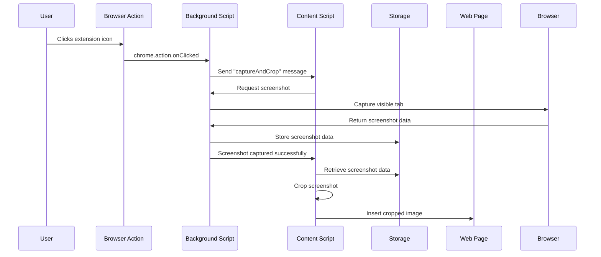

# Screenshot and Crop Chrome Extension

A minimal chrome/browser extension to take a picture of an element from a website.
The image is just appended to the document.
The extension is triggered by clicking its icon in the browser toolbar.

Please inspect the source code, especially `content-script.js`.
There, you can specify which element you would like to capture.

## Installation

1. Clone this repository or download the source code.
2. Open Chrome and navigate to `chrome://extensions`.
3. Enable "Developer mode" in the top right corner.
4. Click "Load unpacked" and select the directory containing the extension files.

## Usage

1. Navigate to the web page containing the element you want to capture. (or reload it if it was open before installation)
2. Click the extension icon in the browser toolbar.
3. The extension will capture a screenshot, crop it to the specified element, and display the result on the page.

## Architecture

1. **Background Script**: Listens for the extension icon click and manages screenshot capture.
2. **Content Script**: Handles the cropping of the screenshot and displays the result.
3. **Storage**: Temporarily stores the full screenshot before cropping.

Here's a diagram of the message and data flow:

## Development

To modify the extension:

1. Edit the relevant files (`manifest.json`, `background.js`, `content-script.js`).
2. Reload the extension in Chrome to test your changes.
